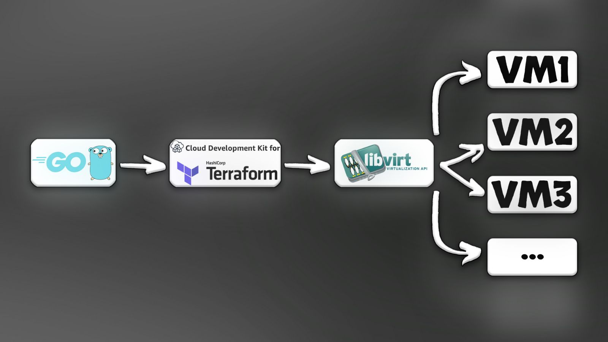

# 🐹⚙️ CDKTF + Libvirt + Go

A project that combines **[CDK for Terraform (CDKTF)](https://developer.hashicorp.com/terraform/cdktf)** with **Go** and the **Libvirt provider** to provision and manage virtual machines (VMs) locally on Linux.



---

## 📖 Overview
This project lets you define and deploy virtual machines using **Go code + YAML configuration**.  

Think of it as **Infrastructure as Code**, but with the flexibility of Go and the power of Terraform.  

---

## ⚙️ Prerequisites
Before using this project, make sure you have:  

1. **Go** (>= 1.20) 🐹  
2. **Terraform CDKTF** installed globally:  

## Quick start

#### Install tools

- clone the project:

```bash
git clone https://github.com/IliyaAG/cdktf-libvirt-go.git
```

- Making the preparing file executable:

```bash
chmod +x cdktf-preparing.sh
```

- Run it:

```bash
./cdktf-preparing.sh
```
